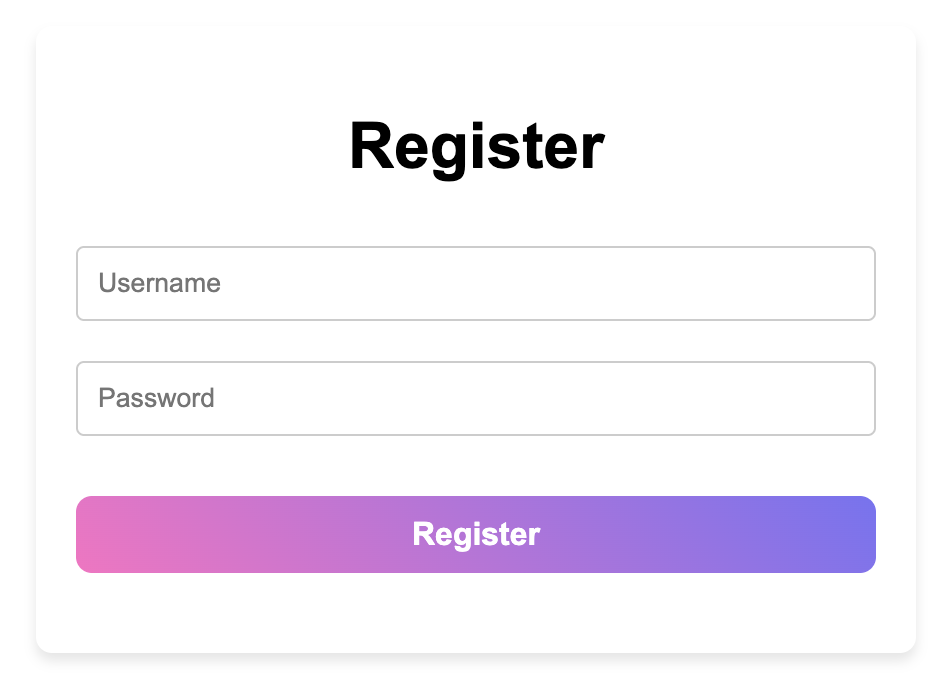
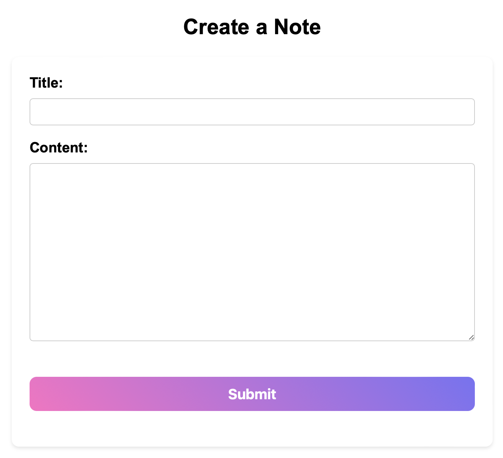
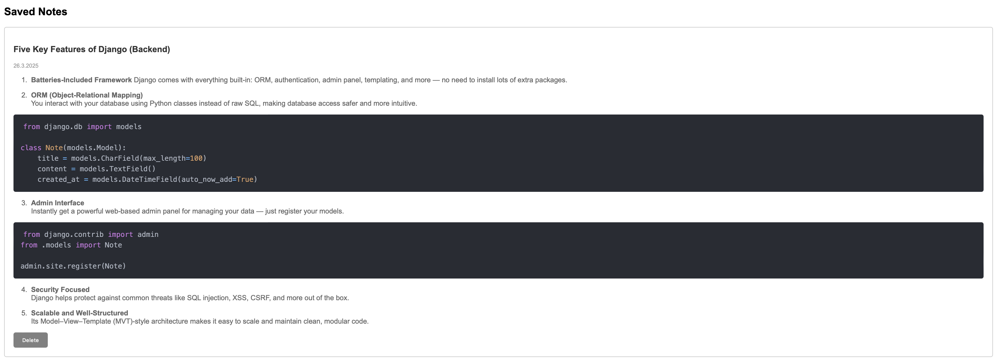
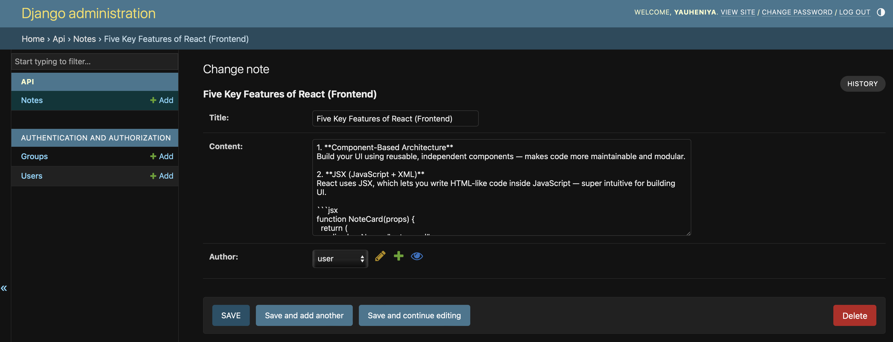

# Django + React Notes App

This is a simple Notes application developed with **Django** for the backend and **React** for the frontend. It supports Markdown formatting with syntax-highlighted code blocks, allowing you to write and display beautifully formatted notes.

🛰️ The application is deployed on **Choreo** and uses a **Neon PostgreSQL** database for persistent data storage.

---

Here’s what the app looks like:

---

Feel free to explore and take notes!

