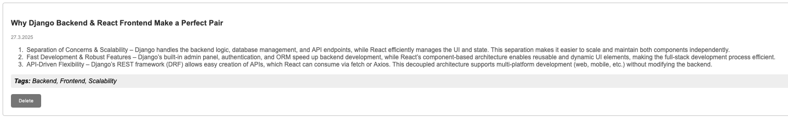

# Django + React Notes App

This is a simple Notes application developed with **Django** for the backend and **React** for the frontend. It supports Markdown formatting with syntax-highlighted code blocks, allowing you to write and display beautifully formatted notes.

--> New Feature: AI-Generated Tags

This app now includes AI-generated tags for your notes, powered by **LangChain** and the public API for the llama3-8b-8192 model from **Groq**. This model offers rapid and efficient tagging by analyzing note content, providing relevant tags automatically.

🛰️ The application is deployed on **Choreo** and uses a **Neon PostgreSQL** database for persistent data storage.

---

Here’s what the app looks like:

New feature – AI-generated tags:

---

Feel free to explore and take notes!

